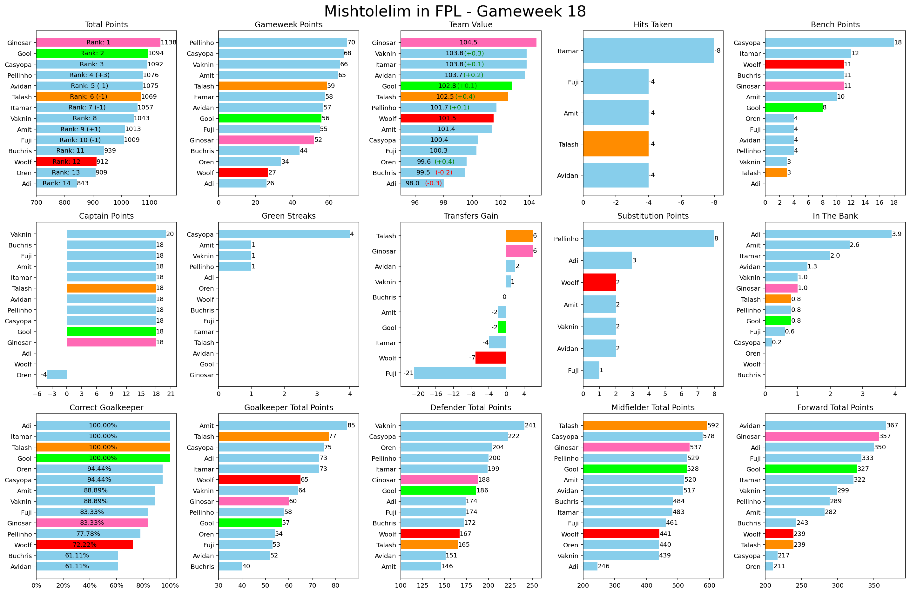
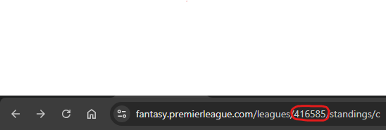
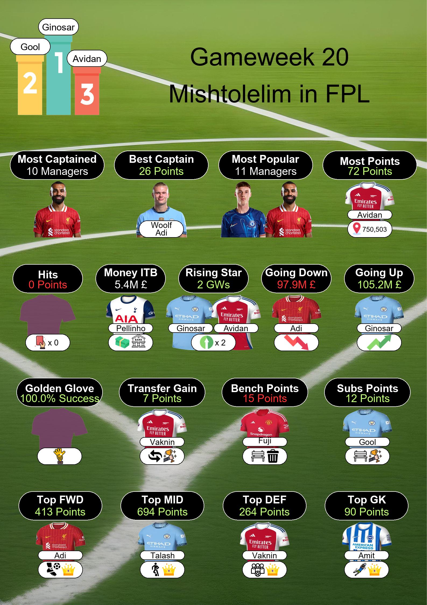

# FPL-League-Summary

This is an FPL gameweek summary for classic leagues between friends.

Compare your ranks and points, including team value, hits, captain points, bench points, substitution points, transfer gains, money in-the-bank, etc.



- **Total Points** (incl. rank & change in current gameweek)
- **Gameweek Points**
- **Team Value** (incl. value gain/loss as of gameweek deadline)
- **Hits**
- **Bench Points**
- **Captain Points**
- **Green Streaks** (consecutive overall rank improvement)
- **Transfers Gain** (immediate points gained/lost from transfers)
- **Substitution Points**
- **Money In the Bank**
- **Correct GK** (percent of gameweeks where you played the GK that got higher points between the two you had)
- **Total Points (GK)**
- **Total Points (DEF)**
- **Total Points (MID)**
- **Total Points (FWD)**

## Configuration
Set 'league_id' variable into your league's personal ID.
The league ID can be found within the fantasy website url under 'Leagues & Cups' after choosing your league

<p>⚠️ Tested on 14 managers league. Ideally use with up to 20 managers for best results</p>

## Advanced Options
### Managers Nickname
For cleaner visuals, you may supply a dictionary with manager ids as keys and nicknames as values.
For example, I used the following dictionary to create the visuals

`def get_team_name(id): return {4399125:"Avidan", 1606327:"Itamar", 262514:"Ginosar", 6697062:"Amit", 4047743:"Fuji", 957:"Gool", 247071:"Woolf", 2513453:"Talash", 2232819:"Vaknin", 4242417:"Buchris", 5859886:"Adi", 1256987:"Casyopa", 6621645:"Pellinho", 4081730:"Oren"}[id]`

### Highlight Managers
In case you want to highlight individual managers within the [Managers Comparison](#fpl-league-summary) plot,
you can supply a dictionary with manager ids as keys and colors as values.
For example, I used the following dictionary to create the visuals

`highlight_keys = {957: "lime", 262514: "hotpink", 247071: "red", 2513453: "darkorange"}`

### Fan Shirts
Fan shirts are determined automatically from every manager FPL account settings (favourite team). In case no team was selected, it assigns a random club shirt.
You can override this by redefining 'get_club' function as follows:

`def get_club(id): return {4399125:"Arsenal", 1606327:"Man Utd", 262514:"Man City", 6697062:"Brighton", 4047743:"Man Utd", 957:"Man City", 247071:"Liverpool", 2513453:"Man City", 2232819:"Arsenal", 4242417:"Spurs", 5859886:"Liverpool", 1256987:"Chelsea", 6621645:"Spurs", 4081730:"Arsenal"}[id]`

## Output
### Text
```
** Mishtolelim in FPL GW 18:
Standings: (1) Ginosar (2) Gool (3) Casyopa
------------------------------
Most Points: Pellinho (70 Points, Overall GW Rank: 1,018,207)
Most Selected: Palmer & M.Salah (11 Teams)
Captained Best: Vaknin (Palmer, 20 Points)
Most Captained: M.Salah (10 Teams)
------------------------------
Highest Team Value: Ginosar (104.5M £)
Lowest Team Value: Adi (98.0M £)
Going Up: Casyopa (4 Greens)
Highest Money in the Bank: Adi (3.9M £)
Most Hits: Itamar (-8 Points)
------------------------------
Highest Substitutes Points: Pellinho (8 Points)
Most Points on Bench: Casyopa (18 Points)
Highest Transfers Gain: Ginosar & Talash (6 Points)
Correct GK: Gool & Talash & Itamar & Adi (100.0%)
------------------------------
Free-Hit Used: Pellinho
Wildcard Used: Casyopa
------------------------------
Most GK Points: Amit (85 Points)
Most DEF Points: Vaknin (241 Points)
Most MID Points: Talash (592 Points)
Most FWD Points: Adi (367 Points)
```

### Managers Comparison ([as shown above](#fpl-league-summary))
### Category Leaders
